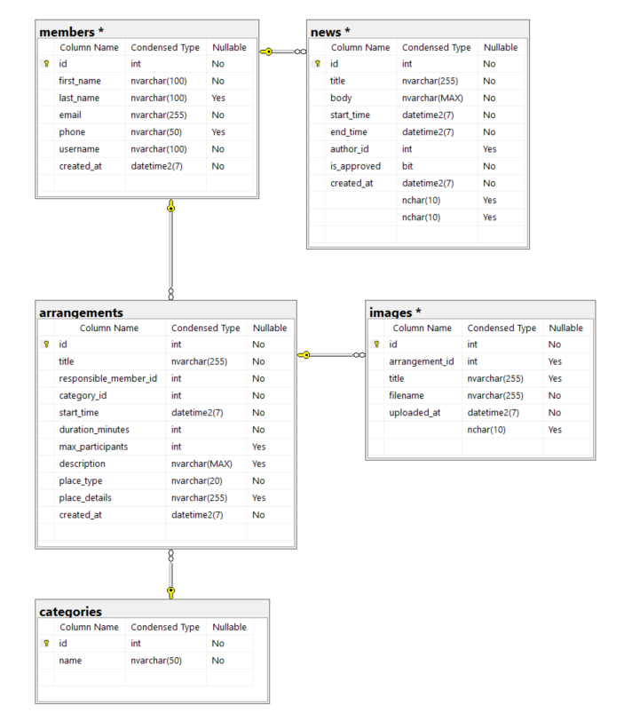
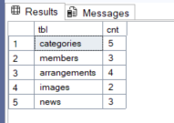
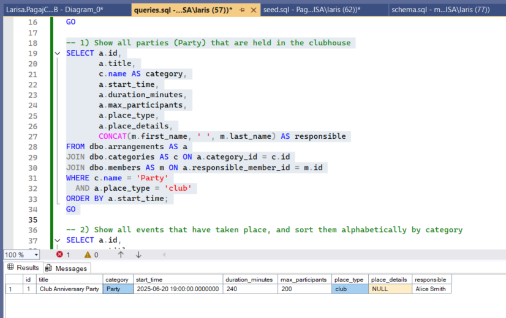
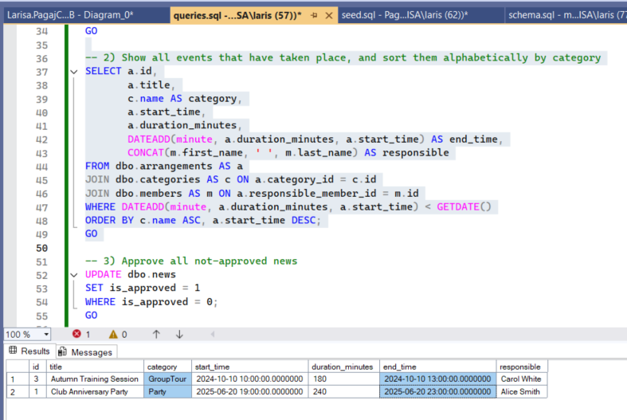
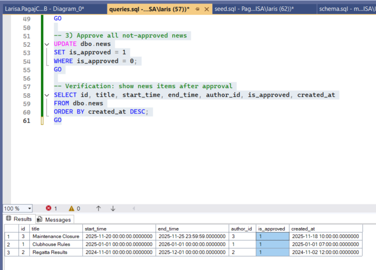

# PagajClubDB — Kayak Club Database

PagajClubDB is a small relational database for a kayak club.  
It stores:

- **Categories** of activities (trips, courses, parties, etc.)
- **Members** of the club
- **Arrangements** (events) organised by the club
- **Images** related to arrangements
- **News** posts for members

## Database

The project uses **Microsoft SQL Server** as the database engine.

All scripts target a database named **PagajClubDB**:

```sql
USE PagajClubDB;
GO
```

The goal of the project is to design the schema, load sample data, run a few example queries, and show the result in an ER diagram and screenshots.

---

## Project files

- `schema.sql` – creates the database `PagajClubDB` with all tables, keys and constraints.
- `seed.sql` – inserts sample data into all tables.
- `queries.sql` – contains three example queries that read and update the data.
- `docs/` – contains the ER diagram and screenshots used in this description.

---

## 1. Database design (schema.sql)

The schema is built around five main tables:

- `categories` — activity types (e.g. “Trip”, “Party”, “Course”).
- `members` — people in the club.
- `arrangements` — events organised by the club.
- `images` — pictures linked to arrangements.
- `news` — announcements and information posts to members.

Relationships:

- Each **arrangement**:
  - belongs to one **category** (`category_id`),
  - has one responsible **member** (`responsible_member_id`).
- Each **image** is linked to one **arrangement** (`arrangement_id`).
- Each **news** item has one **author** (`author_id` → `members.id`).

The ER diagram below shows these tables and relationships as they are created by `schema.sql`:



---

## 2. Sample data (seed.sql)

After creating the schema, `seed.sql` inserts a small set of realistic data:

- a few **categories** (for example: trips, parties, group tours),
- several **members** with contact details,
- different **arrangements** in the future and in the past,
- **images** attached to some arrangements,
- **news** items, some already approved and some not.

To confirm that the data was loaded correctly, the following query is run to show row counts for each table:



---

## 3. Example queries (queries.sql)

The file `queries.sql` contains three example queries that demonstrate how the data can be used.

### Query 1 – Party events in the clubhouse

This query selects all arrangements where:

- the category is **“Party”**, and  
- the place is the **clubhouse** (club).

It returns information about the event, including title, category, time, duration, maximum participants, place details and the responsible member.

Result example:



---

### Query 2 – Past events by category

This query lists all events that have already taken place (end time is before the current time).  
The result is sorted alphabetically by **category**, and shows the event together with its calculated end time and responsible member.

Result example:



---

### Query 3 – Approving news

This query sets all news items that are not yet approved to **approved**, and then shows the content of the `news` table so the change can be seen.

Result example:



---

## 4. Summary

The project demonstrates:

- design of a small but realistic relational model for a club,
- creation of tables with primary keys, foreign keys and basic constraints,
- loading of consistent sample data,
- practical queries for:
  - filtering events,
  - working with dates and times,
  - and updating approval flags in a news table,
- and a clear ER diagram and screenshots showing that the database works as expected.
